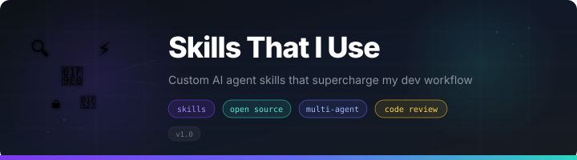

<p align="center">
  
</p>

<h1 align="center">Skills That I Use</h1>

<p align="center">
  <strong>A curated collection of custom AI agent skills that supercharge my dev workflow.</strong>
</p>

<p align="center">
  <a href="#-skills"></a>
  <a href="LICENSE"></a>
  <a href="CONTRIBUTING.md"></a>
  <a href="#-supported-agents"></a>
</p>

<p align="center">
  <sub>Battle-tested workflows that have genuinely changed how I work. Not toy demos.</sub>
</p>

---

## 📦 Skills

| Skill | What It Does | Category |
|-------|-------------|----------|
| [**brainstorming**](skills/brainstorming/) | Explores user intent, requirements, and design through collaborative dialogue before any creative work begins. Turns ideas into fully formed specs. | 🎨 Design |
| [**code-review-using-subagents**](skills/code-review-using-subagents/) | Orchestrates **up to 12 specialist subagents** (security, performance, CTO, controllers, services, domain, tests, etc.) to review commits in parallel. Produces a unified severity-ranked report. | 🔍 Review |
| [**dispatching-parallel-agents**](skills/dispatching-parallel-agents/) | Delegates 2+ independent tasks to specialized agents with isolated context. Precisely crafts instructions so each agent stays focused without inheriting session history. | 🤖 Orchestration |
| [**executing-plans**](skills/executing-plans/) | Loads a written implementation plan, reviews it critically, executes all tasks with review checkpoints, and reports on completion. | 📋 Execution |
| [**finishing-a-development-branch**](skills/finishing-a-development-branch/) | Guides branch completion by presenting structured options for merge, PR, or cleanup once implementation is done and tests pass. | 🏁 Completion |
| [**full-feature-development**](skills/full-feature-development/) | Single entry point that orchestrates the complete feature lifecycle — workspace setup, task execution, reviews, verification, and branch completion. | 🚀 Lifecycle |
| [**receiving-code-review**](skills/receiving-code-review/) | Handles incoming code review feedback with technical rigor — evaluates suggestions critically instead of blindly implementing them. | 🔍 Review |
| [**requesting-code-review**](skills/requesting-code-review/) | Dispatches a code reviewer subagent with precisely crafted context to catch issues before they cascade. Review early, review often. | 🔍 Review |
| [**subagent-driven-development**](skills/subagent-driven-development/) | Executes plans by dispatching a fresh implementer subagent per task, running spec compliance + code quality reviews after each, and a broad whole-branch review at the end. | 🤖 Orchestration |
| [**systematic-debugging**](skills/systematic-debugging/) | Enforces root-cause analysis before proposing fixes. No random patches — trace the bug, understand it, then fix it. | 🐛 Debugging |
| [**test-driven-development**](skills/test-driven-development/) | Write the test first. Watch it fail. Write minimal code to pass. Includes testing anti-patterns guide. | 🧪 Testing |
| [**using-git-worktrees**](skills/using-git-worktrees/) | Ensures feature work happens in isolated workspaces via native tools or git worktree fallback. | 🌿 Git |
| [**using-superpowers**](skills/using-superpowers/) | Bootstrap skill that establishes how to find and invoke skills at conversation start. Includes reference docs for 6+ AI coding agents. | ⚡ Meta |
| [**verification-before-completion**](skills/verification-before-completion/) | Requires running verification commands and confirming output before making any success claims. Evidence before assertions, always. | ✅ Quality |
| [**writing-plans**](skills/writing-plans/) | Writes comprehensive implementation plans assuming the reader has zero context. Bite-sized tasks with DRY, YAGNI, and TDD principles. | 📋 Planning |
| [**writing-skills**](skills/writing-skills/) | TDD applied to process documentation. Create, edit, and verify skills work before deployment. Includes Anthropic best practices. | ✍️ Authoring |

---

## 🚀 Installation

```bash
git clone https://github.com/fakhrulsojib/skills-that-i-use.git ~/skills-that-i-use
```

Then link or copy the skill(s) you want into your agent:

<details>
<summary><strong>Claude Code</strong></summary>

```bash
# Global (all projects)
ln -s ~/skills-that-i-use/skills/<skill-name> \
      ~/.claude/skills/<skill-name>

# Or project-specific
ln -s ~/skills-that-i-use/skills/<skill-name> \
      .claude/skills/<skill-name>
```
</details>

<details>
<summary><strong>Antigravity</strong></summary>

```bash
ln -s ~/skills-that-i-use/skills/<skill-name> \
      ~/.gemini/config/skills/<skill-name>
```
</details>

<details>
<summary><strong>OpenAI Codex CLI</strong></summary>

Codex uses `AGENTS.md` for instructions. Append the skill content:

```bash
# Global
cat ~/skills-that-i-use/skills/<skill-name>/SKILL.md \
    >> ~/.codex/AGENTS.md

# Or project-specific
cat ~/skills-that-i-use/skills/<skill-name>/SKILL.md \
    >> ./AGENTS.md
```
</details>

<details>
<summary><strong>Cursor</strong></summary>

```bash
mkdir -p .cursor/rules
cp ~/skills-that-i-use/skills/<skill-name>/SKILL.md \
   .cursor/rules/<skill-name>.mdc
```
</details>

<details>
<summary><strong>Windsurf</strong></summary>

```bash
mkdir -p .windsurf/rules
cp ~/skills-that-i-use/skills/<skill-name>/SKILL.md \
   .windsurf/rules/<skill-name>.md
```
</details>

<details>
<summary><strong>GitHub Copilot</strong></summary>

```bash
mkdir -p .github/instructions
cp ~/skills-that-i-use/skills/<skill-name>/SKILL.md \
   .github/instructions/<skill-name>.instructions.md
```
</details>

---

## 📁 Repo Structure

```
skills-that-i-use/
├── README.md
├── LICENSE
├── CONTRIBUTING.md
├── CODE_OF_CONDUCT.md
├── SECURITY.md
├── CHANGELOG.md
├── .editorconfig
├── skills/
│   ├── brainstorming/
│   ├── code-review-using-subagents/
│   ├── dispatching-parallel-agents/
│   ├── executing-plans/
│   ├── finishing-a-development-branch/
│   ├── full-feature-development/
│   ├── receiving-code-review/
│   ├── requesting-code-review/
│   ├── subagent-driven-development/
│   ├── systematic-debugging/
│   ├── test-driven-development/
│   ├── using-git-worktrees/
│   ├── using-superpowers/
│   ├── verification-before-completion/
│   ├── writing-plans/
│   └── writing-skills/
├── examples/
└── docs/
    └── assets/
```

---

## 🤝 Contributing

Contributions are welcome — new skills, better prompts, docs, bug fixes.

See [CONTRIBUTING.md](CONTRIBUTING.md) for guidelines.

---

## 📄 License

[MIT](LICENSE)

---

<p align="center">
  <sub>Made with ❤️ by <a href="https://www.linkedin.com/in/fakhrulsojib/">fakhrulislam</a></sub>
</p>
