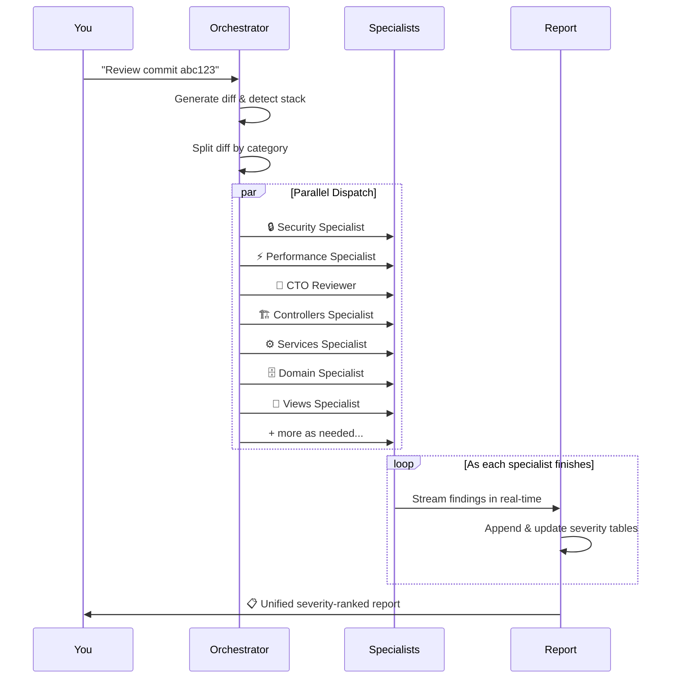

# 🔍 Multi-Agent Code Review

> 12 AI specialists. One command. Zero blind spots.

A skill that turns `review commit abc123` into a **full-scale, multi-perspective code audit**. Instead of one AI reviewing everything, it spawns **up to 12 specialized subagents** — each an expert in a different domain — that review your changes simultaneously.

---

## How It Works



---

## The Review Team

| Agent | Focus | Runs On |
|-------|-------|---------|
| 🔒 **Security** | OWASP Top 10, auth bypass, injection, secrets, CSRF | Every review |
| ⚡ **Performance** | N+1 queries, memory leaks, concurrency, caching | Every review |
| 👔 **CTO** | Architecture, SOLID, scalability, tech debt strategy | Every review |
| 🏗️ **Controllers** | Request handling, parameter binding, HTTP security | When relevant files change |
| ⚙️ **Services** | Transaction boundaries, business logic, null safety | When relevant files change |
| 🗄️ **Domain/ORM** | Schema changes, constraints, cascades, migrations | When relevant files change |
| 🎨 **Views/UI** | XSS, template composition, accessibility, assets | When relevant files change |
| 🔧 **Build/Config** | Dependencies, CVEs, Dockerfile, runtime config | When relevant files change |
| 🧪 **Tests** | Coverage gaps, assertion quality, framework compat | When relevant files change |
| 🧹 **Tech Debt** | Dead code, duplication, unused imports, TODOs | Large changesets (50+ files) |
| 🛡️ **Filters** | Middleware ordering, auth filter gaps, CORS | When relevant files change |
| 🏭 **Infrastructure** | Bootstrap, logging, shell scripts, system config | When relevant files change |

---

## Usage

```
Review commit abc1234
```
```
Review commits bb47ae7 and 5d1f40f9 as a single unit of work
```
```
Review my feature branch against main
```
```
Do a quick review of commit abc1234
```

---

## Output

A single `code_review_report.md` with:

- **Executive Summary** — 2-3 sentence overall assessment
- **Findings by Severity** — 🔴 Critical → 🟠 High → 🟡 Medium → 🟢 Low
- **Detailed Findings** — Exact file locations + production-ready drop-in code fixes
- **What Was Done Well** — Positive highlights

Findings stream into the report in real-time as each specialist finishes.

📄 **[See a full example report →](../../examples/sample_report.md)**

---

## Configuration

| Option | Default | Description |
|--------|---------|-------------|
| Commit SHAs | *(required)* | Which commits to review |
| Unit of work | Yes (if sequential) | Treat multiple commits as one logical change |
| Review depth | `thorough` | `quick` (3-4 agents) or `thorough` (10-14 agents) |
| Focus areas | All | Limit to specific categories |
| Tech stack | Auto-detect | Override if needed |

### Quick vs Thorough Mode

| Mode | Agents | Best For |
|------|--------|----------|
| **Quick** | 3-4 | Small changes, fast feedback, CI integration |
| **Thorough** | 10-14 | Large PRs, migrations, pre-release audits |

### Supported Stacks (Auto-Detected)

Grails/Groovy · Java/Maven · Node.js/JS/TS · Python · Go · Rust

---

## Agent Compatibility

| Agent | Subagent Support | Parallel Review | Notes |
|-------|-----------------|-----------------|-------|
| **Antigravity** | ✅ | ✅ | Full support, recommended |
| **Claude Code** | ✅ | ✅ | Full support |
| **OpenAI Codex CLI** | ✅ | ✅ | Append SKILL.md to AGENTS.md |
| **Cursor** | ⚠️ Limited | ❌ | May run sequentially |
| **Windsurf** | ⚠️ Limited | ❌ | May run sequentially |
| **GitHub Copilot** | ⚠️ Limited | ❌ | May run sequentially |

---

## Why It's a Gamechanger

- **Catches what humans miss** — 12 expert "eyes" on every commit
- **Minutes instead of hours** — parallel agents, not sequential human review
- **Consistent** — same rigorous checklists every time, regardless of who triggers it
- **Resilient** — retry logic + self-review fallback, no category ever skipped
- **Read-only** — all subagents sandboxed, they cannot touch your code

---

## Troubleshooting

<details>
<summary><strong>The skill doesn't trigger when I say "review commit"</strong></summary>

Make sure the SKILL.md is in the correct location for your agent. The skill triggers on keywords like "review", "audit", "code review" followed by commit references. Try being more explicit: `"Review commit abc1234 using the code review skill"`.
</details>

<details>
<summary><strong>Some subagents fail or time out</strong></summary>

The skill has built-in resilience: 2 retries per agent with 60-90 second cooldowns, then a self-review fallback. If you're hitting persistent rate limits, try `quick` mode to reduce the number of parallel agents.
</details>

<details>
<summary><strong>The report is missing some categories</strong></summary>

Categories are activated based on which files changed. If no controller files were modified, the Controllers Specialist won't run. Security, Performance, and CTO always run regardless.
</details>

<details>
<summary><strong>Can I focus on just one area?</strong></summary>

Yes! Ask: `"Review commit abc123, focus on security only"`. The skill will dispatch only the relevant specialist(s).
</details>

---

## Files

| File | Purpose |
|------|---------|
| `SKILL.md` | Core skill instructions — this is what your agent reads |
| `scripts/split_diff.sh` | Helper that splits a combined diff into category-specific patches |
